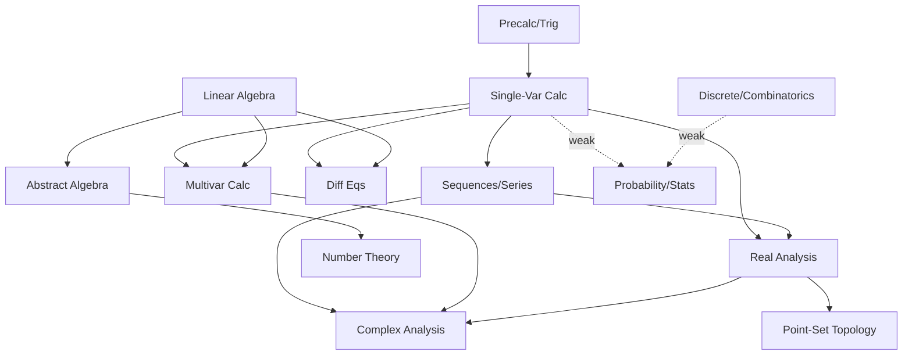

# Stress-Testing the "Speedrun" Design Theses for the GRE Mathematics Subject Test

**Scope.** This report evaluates seven design theses behind a study app ("Speedrun") for the GRE Mathematics Subject Test (the advanced subject test: ~66 five-choice questions, scored 200–990, number-right then equated across forms). Each section ends with a VERDICT (well-supported / shaky / wrong). Primary and peer-reviewed sources are prioritized; anecdotal/crowdsourced sources are flagged explicitly throughout.

**Bottom line up front:** Three of the team's five core theses are well-supported (memory≠performance; calibrated abstaining range; interleaving=discrimination training); the Pareto/prerequisite-gating thesis is mixed and its headline number is overstated; and the "knowledge-graph beats flat model" claim is shaky-to-wrong for this app's sparse-data regime and should be demoted.

---

## 1. CONTENT MAP (subtopic level)

### Official ETS structure (primary source)
ETS's "Content and Structure" page states the test is "approximately 66 multiple-choice questions," with **Calculus 50%, Algebra 25%, Additional Topics 25%**. Verbatim: "Approximately 50% of the questions involve calculus and its applications... About 25% of the questions in the test are in elementary algebra, linear algebra, abstract algebra and number theory. The remaining questions deal with other areas of mathematics currently studied by undergraduates." This is a committee **design target**, not a count of any one released form.

The ETS Mathematics Practice Book lists the official subtopics within each content area:
- **I. Calculus (50%):** differential and integral calculus of one and several variables; applications; coordinate geometry; trigonometry; differential equations; connections to other branches of mathematics.
- **II. Algebra (25%):** Elementary algebra; Linear algebra (systems of linear equations, matrices, vector spaces, linear transformations, eigenvalues/eigenvectors, characteristic polynomials); Abstract algebra and number theory (elementary group theory, theory of rings and modules, field theory, number theory).
- **III. Additional Topics (25%):** Introductory real analysis (sequences/series, continuity, differentiability, integrability, elementary topology of R and Rⁿ); Discrete mathematics (logic, set theory, combinatorics, graph theory, algorithms); other (general/point-set topology, geometry, complex variables, probability and statistics, numerical analysis).

### Mapping % to question counts (~66)
Calculus ≈ 33 questions; Algebra ≈ 16–17; Additional Topics ≈ 16–17.

### Subtopic estimates from credible analyses (ALL ESTIMATES — NOT VERIFIED COUNTS)
No public source counts a specific released form (GR0568, GR1268/GR1768, GR9367, GR8767, GR9768) question-by-question across all fine-grained topics. ETS does not publish a per-topic breakdown; released books give only the 50/25/25 split. What exists are tutor/student estimates derived from working through multiple forms:

| Topic | Est. # questions (~66) | Source / status |
|---|---|---|
| Single-variable calculus | ~16–17 (≈25%) | dzackgarza GRE workshop notes — *estimate* |
| Multivariable calculus | ~3–5 | weebly GRE test-material (author saw 6 forms) — *estimate* |
| Differential equations | ~3 | dzackgarza — *estimate* |
| Sequences/series | folded into calculus | mathsub / Coley notes — *estimate* |
| Linear algebra | ~7 (≈10%) | dzackgarza; weebly (10–15) — *estimate* |
| Abstract algebra | ~3–7 (5–10%) | dzackgarza — *estimate* |
| Number theory | ~1–2 | dzackgarza — *estimate* |
| Real analysis | ~1–3 | mathematicsgre forum — *estimate* |
| Complex analysis | ~1–3 | dzackgarza (~3); weebly (1–2) — *estimate* |
| Topology / point-set | ~1–2 | weebly — *estimate* |
| Discrete / combinatorics | ~1–2 | dzackgarza — *estimate* |
| Probability / statistics | ~3–5 | weebly — *estimate* |
| Numerical analysis | ~0–1 | mathematicsgre forum — *estimate* |
| Logic / set theory | ~1 | mathsub about-test — *estimate* |
| Geometry | ~1 | dzackgarza — *estimate* |

**Divergence from official weights.** Credible practitioners say the test is even MORE calculus- and linear-algebra-weighted in practice. UConn's department page: "Most questions, perhaps surprisingly, are on single and multivariable calculus and linear algebra!" — but it also warns, "An exam could have 6–7 questions on a topic or just 1 question," confirming high per-form variance. The complete absence of a verified fine-grained count is the single biggest data gap; the app must not present subtopic counts as established fact.

**VERDICT (content map): WELL-SUPPORTED at the 3-bucket level** (50/25/25 is primary/official) **; SHAKY at the subtopic level** — only tutor/student estimates exist, with acknowledged high per-form variance. Flag every subtopic count as an estimate.

---

## 2. DOES PARETO HOLD?

The team's "20% of topics = 80% of questions" framing is roughly the right *shape* but imprecise. Counting the 3 official buckets, Calculus (1 of 3) accounts for 50% of questions. Counting ~15 fine topics, the top ~4 (single-var calc, multivar calc, linear algebra, sequences/series) plausibly account for ~60–70% of questions. So "a small minority of topics drives the majority of questions" is TRUE in spirit, but the crisp "20/80" is an approximation, not a measured fact.

**The team's specific claim "calculus + linear algebra ≈ 65–70%": OVERSTATED.** Best available evidence:
- Calculus alone ≈ 50% (ETS, official).
- Linear algebra is only PART of the 25% algebra bucket; the best practitioner estimate puts it at ~10% (dzackgarza: "Linear algebra takes up about 10%").
- Therefore **calculus + linear algebra specifically ≈ 55–60%**, not 65–70%.
- You reach ~70–75% only by adding ALL of algebra (linear + abstract + number theory): 50% + 25% = ~75%.

The team's own note flagging this as weak "community consensus" is correct — and the consensus, when examined, supports ~55–60% for calc+linear-algebra. The 65–70% figure should be revised down, or redefined as "calculus + all algebra ≈ 70–75%."

**Low-yield long tail (tutor consensus + student reports):** point-set/general topology (~1–2 q), complex analysis (~1–3 q), numerical analysis (~0–1 q), abstract-algebra deep cuts, logic/set theory (~1 q), with modest probability/combinatorics. mathsub.com explicitly notes numerical analysis is frequently over-studied yet rarely tested. Several 2024 r/math and mathematicsgre forum posters report the modern test reaching further into advanced topics (e.g., an algebraic-topology question appearing) — so the tail is real but slowly fattening (anecdotal; flag as such).

**VERDICT (Pareto): DIRECTIONALLY WELL-SUPPORTED, but the headline number is SHAKY/overstated.** A heavy-tailed concentration genuinely exists; "calc + linear algebra ≈ 65–70%" should be corrected to ~55–60% (calc + linear algebra) or reframed as ~70–75% (calc + all algebra).

---

## 3. IS IT A REAL PREREQUISITE GRAPH?

### Proposed prerequisite DAG (nodes + directed edges)
Nodes: Precalculus/Trig (PC), Single-Variable Calculus (SVC), Multivariable Calculus (MVC), Differential Equations (ODE), Sequences & Series (SS), Linear Algebra (LA), Abstract Algebra (AA), Number Theory (NT), Real Analysis (RA), Complex Analysis (CA), Point-Set Topology (TOP), Discrete Math/Combinatorics (DM), Probability & Statistics (PR), Numerical Analysis (NA).

Directed edges (A → B = A is prerequisite to B), with strength:

| Edge | Strength |
|---|---|
| PC → SVC | Strong |
| SVC → MVC | Strong |
| SVC → SS | Strong |
| SVC → ODE | Strong |
| SVC → RA | Strong |
| SS → RA | Strong |
| SS → CA | Medium |
| MVC → CA | Medium |
| LA → ODE (systems) | Medium |
| LA → MVC (Jacobians, linear maps) | Medium |
| LA → AA | Medium |
| RA → TOP | Medium |
| RA → CA | Medium |
| AA → NT (overlap; partly bidirectional) | Medium |
| PC → DM | Weak / near-independent |
| SVC → PR (continuous probability) | Weak |
| DM → PR | Weak |
| {SVC, LA} → NA | Weak |

### Assessment of depth
- **Strong, deep chains:** PC → SVC → {MVC, SS, ODE, RA} → {CA, TOP}. This is the spine of the test and matches standard university sequencing. **Calculus is correctly the dominant root — the team is RIGHT about this.**
- **Weak / effectively independent nodes:** Discrete math/combinatorics is largely self-contained (needs only basic algebra/logic). Probability is semi-independent (continuous probability uses integration, but most GRE probability is combinatorial/elementary). Point-set topology is mostly self-contained beyond basic real-analysis vocabulary. Elementary number theory is near-independent despite its abstract-algebra overlap.
- **Critical observation:** Most of the test's MASS sits in shallow, already-completed calculus/linear-algebra nodes. The genuinely DEEP chains (RA → TOP, RA → CA) live in the LOW-yield tail. So the graph is real, but its depth is concentrated where question yield is lowest.

**VERDICT (prerequisite graph): PARTIALLY SUPPORTED.** A genuine DAG exists and calculus is correctly the dominant root. BUT the dependency structure is shallow where it matters most (the high-yield calc/LA core) and deep only in the low-yield tail. This materially undercuts the case that a graph model would beat a flat model for THIS exam (see §4).

---

## 4. ACADEMIC SUPPORT for a prerequisite-graph learning system

### Evidence FOR modeling prerequisites / knowledge structure
- **Knowledge Space Theory (Doignon & Falmagne 1985)** underpins ALEKS. **ALEKS meta-analysis (Sun, Else-Quest, Hodges, French & Dowling 2021, *Investigations in Mathematics Learning* 13(3):182–196):** across 56 independent effect sizes / 9,238 students / 33 studies (2000–Aug 2020), "learning performance with ALEKS was comparable to that with traditional instruction (Hedge's g = 0.05, 95% CI [−0.01, 0.20]) and ALEKS was especially effective when used to supplement traditional instruction (g = 0.43, 95% CI [0.02, 0.83])." Takeaway: structured-knowledge tutoring is a strong *supplement*, not a stand-alone replacement for good instruction.
- **Gagné learning hierarchies (1968, 1970)** provide the classic theoretical basis for hierarchical prerequisite sequencing.
- **KLI framework (Koedinger, Corbett & Perfetti 2012, *Cognitive Science* 36(5):757–798)** formalizes knowledge components and argues the instructional method must match the KC type.
- **Graph-based Knowledge Tracing (GKT; Nakagawa, Iwasawa & Matsuo 2019):** casting knowledge structure as a graph and using GNNs achieved the highest AUC vs. DKT/DKVMN baselines, with "relative improvement... 6.25% at best." Notably, GKT did this with roughly **10× fewer parameters** than DKT.
- **Prerequisite-Driven Deep Knowledge Tracing (Chen et al. 2018, IEEE ICDM)** integrates prerequisite relations between skills and reports gains; later families (PEBG, GIKT) add question-skill graphs.

### DISCONFIRMING evidence (graph/deep does NOT robustly beat flat)
- **Khajah, Lindsey & Mozer 2016, "How deep is knowledge tracing?" (EDM; arXiv:1604.02416):** BKT with relaxed assumptions (forgetting, student ability, skill discovery) MATCHES DKT. Verbatim: "knowledge tracing may be a domain that does not require 'depth'; shallow models like BKT can perform just as well and offer us greater interpretability."
- **Xiong et al. 2016 ("Going deeper with deep knowledge tracing," EDM):** found DUPLICATE records in the ASSISTments dataset that had inflated DKT's reported advantage; re-evaluation shrinks DKT's edge substantially.
- **Wilson et al. 2016:** simple Bayesian IRT (among the simplest learner models) can OUTPERFORM DKT.
- **Gervet, Koedinger, Schneider & Mitchell 2020 ("When is deep learning the best approach to knowledge tracing?", JEDM):** model ranking depends heavily on the dataset — deep models win mainly with large data and rich structure; simpler logistic/IRT models win on small or highly structured data.

### Synthesis for Speedrun
The GKT 6.25%-AUC headline is real but: (a) it is a relative AUC gain in within-system *next-item prediction*, not a *score-prediction* improvement; (b) it required large interaction datasets; and (c) the same literature repeatedly shows flat/shallow models match deep ones once tuned. Speedrun will face SPARSE per-user data (a few dozen practice items), no large interaction corpus, and a shallow high-yield graph (§3). In that regime the disconfirming literature dominates.

**VERDICT (graph beats flat): SHAKY / likely WRONG for Speedrun's regime.** The literature is genuinely mixed; graph gains are modest (single-digit relative AUC), data-hungry, and frequently erased by well-tuned flat models (BKT+/IRT). For a sparse-data exam-prep tool, a well-calibrated flat per-topic model (or IRT) is the honest baseline; a graph adds complexity with little expected payoff.

---

## 5. MATH-SPECIFIC LEARNING SCIENCE

### Interleaving (native-math evidence — strong)
- **Rohrer & Taylor 2007, "The shuffling of mathematics problems improves learning," *Instructional Science* 35:481–498:** mixed (interleaved) practice improved delayed test performance over blocked practice.
- **Rohrer 2012, "Interleaving helps students distinguish among similar concepts," *Educational Psychology Review* 24:355–367.**
- **Rohrer, Dedrick & Stershic 2015, "Interleaved practice improves mathematics learning," *J. Educational Psychology* 107(3):900–908:** 126 seventh-graders; heavier interleaving → higher delayed-test scores; the authors conclude interleaving works "not only by improving discrimination between different kinds of problems, but also by strengthening the association between each kind of problem and its corresponding strategy" — direct support for the team's "interleaving = discrimination trainer" thesis.
- **Rohrer, Dedrick, Hartwig & Cheung 2020, "A randomized controlled trial of interleaved mathematics practice," *J. Educational Psychology* 112(1):40–52:** preregistered cluster RCT, 787 students / 54 classes / 5 schools (IES grant R305A160263). Per IES, "the increased dose of interleaving sharply boosted scores on the unannounced test, **61 percent vs. 38 percent, d = 0.83**" (95% CI [0.68, 0.97]); test administered one month after practice. Meets What Works Clearinghouse standards without reservations.
- **Caveat:** interleaving was confounded with spacing (interleaved problems were also distributed across worksheets), so part of the benefit is attributable to spacing.

### Spacing / distributed practice
- **Cepeda, Pashler, Vul, Wixted & Rohrer 2006, "Distributed practice in verbal recall tasks," *Psychological Bulletin* 132(3):354–380:** meta-analysis of 839 assessments / 317 experiments / 184 articles; spaced > massed, and the optimal inter-study interval grows with the retention interval.
- **Emeny, Hartwig & Rohrer 2021 (*Applied Cognitive Psychology* 35:1082–1089):** spaced math practice improved test scores and reduced overconfidence.

### Worked examples / cognitive load
- **Sweller & Cooper 1985, "The use of worked examples as a substitute for problem solving in learning algebra," *Cognition and Instruction* 2(1):59–89:** across five experiments, algebra students who studied worked examples "take roughly half as long to solve similar problems on a post-test, and they make 1/5 as many errors" than conventional problem-solvers — with the documented limitation that "the effect doesn't seem to extend to post-test problems with even modest variations from the problems studied" (i.e., muted transfer).
- **Sweller 1988 (*Cognitive Science* 12:257–285):** cognitive load theory; means-ends problem solving overloads working memory and impairs schema acquisition.

### Testing effect for math problem-solving (important nuance)
- The testing/retrieval-practice effect is robust for declarative memory, but its transfer to math PROCEDURES is contested. **Huang, Zheng, Yu & Chen 2023, "Retrieval practice may not benefit mathematical word-problem solving," *Frontiers in Psychology* 14:1093653:** across three experiments, example-problem (testing) pairs did NOT beat restudy on delayed problem-solving tests — "there may be no retrieval practice effect on acquiring problem-solving skills from worked examples."
- **Leahy, Hanham & Sweller 2015 (*Educational Psychology Review* 27:291–304):** high element-interactivity material can fail to show a testing effect.
- Counterpoint: retrieval practice that targets transfer/application (not just re-solving) shows gains in some higher-math settings (e.g., May 2021; a 2025 *Int. J. Science and Mathematics Education* first-year university study).

**VERDICT (learning science): LARGELY WELL-SUPPORTED.** Interleaving (d ≈ 0.83 in a large math RCT), spacing, and worked examples have strong, math-native evidence. The one important correction: the team should NOT assume the "testing effect" transfers cleanly to math problem-solving — for skill acquisition, worked examples + interleaving are better supported than pure retrieval drilling.

---

## 6. SCORE ESTIMATION & HONEST UNCERTAINTY

### How the 200–990 score is derived
- Scale: **200–990 in 10-point increments**; ~66 questions; **number-right scoring then equated** across forms. Modern forms (the GR1768 reissue) removed the old −¼-per-wrong formula penalty; older paper forms used formula scoring.
- Pre-October-2001, the test was rescaled because too many examinees hit perfect scores; ETS warns scores before/after that date are not comparable.

### Raw → scaled conversion tables (they EXIST)
The released practice book and old forms include score-conversion tables. The most useful cross-form artifact is the **unofficial mathsub.com raw-to-scaled chart (2019)** [CROWDSOURCED — flag]. It tabulates raw→scaled→percentile for GR1768, GR0568, GR9768, GR9367, GR8767, and shows that older forms required MORE correct answers for the same scaled score (e.g., raw 66 → 970/99th on the modern scale; on GR8767 a raw in the low-50s already mapped to ~820). This directly demonstrates equating: identical raw scores map to different scaled scores across forms.

### Score-to-percentile interpretive data (verified against ETS)
- **Mean/SD — ETS Table 2A**, based on "all individuals who tested between July 1, **2021**, and June 30, **2024**": Mathematics Test, **N = 5,180, mean 680, SD 161**.
- **Older cohort (2011–2014, Wikipedia-cited):** mean **659**, SD **137**.
- **Percentile anchors — ETS Table 2B** (a DIFFERENT cohort: "all individuals who tested between July 1, **2019**, and June 30, **2023**"), "% scoring lower": **680 = 49th**, 700 = 53rd, 760 = 64th, 800 = 71st, **880 = 88th**, 900 = 91st, 600 = 34th, 500 = 14th, 400 = 3rd.
- The team's interpretive anchors are accurate: **median ≈ 680** ✓ and **~880 ≈ 90th percentile** ✓ (precisely 88th; the 90th percentile sits near 890). (Note the mild cohort mismatch: the mean/SD and the percentile table are from slightly different reporting windows.)

### IRT basics (for estimating ability θ)
- **1PL / Rasch:** item difficulty only; P(correct) = logistic(θ − b).
- **2PL:** adds discrimination a: logistic(a(θ − b)).
- **3PL:** adds a guessing parameter c — appropriate for 5-choice multiple-choice (c ≈ 0.2).
- Item characteristic curves map θ → P(correct). ETS uses IRT-based equating to place different forms on a common scale.
- Foundational sources: **Lord 1980** (*Applications of Item Response Theory to Practical Testing Problems*); **Hambleton, Swaminathan & Rogers 1991** (*Fundamentals of Item Response Theory*); **Embretson & Reise 2000** (*Item Response Theory for Psychologists*).

### Honest readiness prediction under SPARSE data (supports SPOV2)
- **Conformal prediction (Vovk et al.; Angelopoulos & Bates 2023, *Foundations and Trends in ML* 16(4):494–591, doi:10.1561/2200000101):** distribution-free prediction sets/intervals with finite-sample coverage guarantees — wrap any model to output, e.g., a 90% score interval.
- **Conformalized Quantile Regression (Romano, Patterson & Candès 2019, *NeurIPS* 32:3538–3548):** adapts interval WIDTH to local uncertainty (heteroscedastic) while keeping coverage — exactly the "calibrated RANGE that widens under sparse data" the team wants.
- **Calibration:** Brier score (1950); Expected Calibration Error; **Guo, Pleiss, Sun & Weinberger 2017 (*ICML*)** — modern nets are poorly calibrated, fixable with temperature scaling.
- **Selective prediction / abstention:** **Geifman & El-Yaniv 2017 (*NeurIPS*)** selective classification with risk–coverage guarantees; **El-Yaniv & Wiener 2010 (*JMLR* 11:1605–1641)** foundations — formalizes ABSTAINING when confidence is insufficient.

**VERDICT (score estimation & honest uncertainty): WELL-SUPPORTED.** The scoring mechanics, percentile anchors, IRT framing, and the conformal/selective-prediction toolkit are all accurately invoked. SPOV2 (a calibrated abstaining range) is the team's most defensible thesis. Practical caution: with ~66-item forms and sparse per-user practice, conformal intervals will be WIDE and abstention frequent — that is honest, and the UI must communicate it rather than hide it.

---

## 7. OVERALL VERDICT

- **(a) Memory ≠ performance (SPOV1): WELL-SUPPORTED.** Soderstrom & Bjork 2015 (*Perspectives on Psychological Science* 10:176–199) is exactly on point: performance during acquisition is an unreliable index of durable learning, and the two can be inversely related. Recognition fluency is a treacherous transfer predictor. Keep this thesis — it is the strongest conceptual pillar.
- **(b) Honest abstaining range (SPOV2): WELL-SUPPORTED.** Conformal prediction, CQR, calibration (Guo 2017), and selective prediction (Geifman & El-Yaniv 2017) form a coherent, citable stack. Keep — but set expectations that intervals will be wide and abstention common under sparse data.
- **(c) Interleaving = discrimination training (SPOV3): WELL-SUPPORTED.** Native-math RCT evidence (Rohrer et al. 2020: 61% vs 38%, d = 0.83) and the explicit mechanism in Rohrer et al. 2015 directly support it. Keep — but pair with spacing (confounded and synergistic) and lead with worked examples for novices.
- **(d) Score gated by weakest prerequisite + Pareto core (SPOV4): MIXED — SOFTEN.** Calculus-as-dominant-root is correct, and a high-yield concentration is real. BUT: (i) "calc + linear algebra ≈ 65–70%" is OVERSTATED — it is ~55–60%; reframe as "calc + all algebra ≈ 70–75%." (ii) "Gated by the single weakest prerequisite" is too strong: every item is equally weighted and number-right scored, so the score is closer to a WEIGHTED SUM across topics than a min() over prerequisites. A genuinely weak calculus foundation does cap achievable score (calculus is half the test), but a single weak tail topic costs only 1–2 points. Model expected score as a topic-weighted sum with calculus mastery as a strong multiplier, not a hard gate.
- **(e) Knowledge-graph beats flat (part of SPOV4): SHAKY / likely WRONG for this app.** Graph KT gains are modest (GKT ≈ 6.25% relative AUC), data-hungry, and repeatedly matched by tuned flat models (Khajah et al. 2016; Xiong et al. 2016; Wilson et al. 2016). The GRE-math prerequisite graph is shallow in its high-yield core. Drop or de-prioritize the knowledge-graph model; ship a well-calibrated flat per-topic or IRT model first.

### What the team SHOULD change
1. **Re-state the Pareto core number** to "calculus + all algebra ≈ 70–75%; calculus + linear algebra ≈ 55–60%," and label all subtopic counts as estimates with high per-form variance.
2. **Replace "min over prerequisites" with a calculus-weighted topic sum** for score prediction; reserve prerequisite logic for STUDY SEQUENCING (where Gagné/KLI support it), not score gating.
3. **Demote the knowledge graph to a v2 experiment.** Ship flat IRT/BKT-style mastery + conformal intervals first; adopt a graph only if held-out *score-prediction* error actually drops.
4. **Lead pedagogy with worked examples → interleaved + spaced practice**, and do NOT assume retrieval drilling alone transfers to math problem-solving (Huang et al. 2023).
5. **Make abstention a feature, not a bug:** show the calibrated range and an explicit "insufficient data" state.
6. **Benchmarks that would change these rulings:** (i) if the team builds a *verified* per-form question-by-question count across all forms and calc+LA truly clears 65%, restore the higher Pareto number; (ii) if a graph model beats a tuned flat/IRT baseline on held-out score prediction by a meaningful margin (not just within-system next-item AUC) on the team's own data, promote the graph.

### Source-quality flags
- **Primary / peer-reviewed:** ETS official pages and PDFs (content/structure, practice book, interpretive Tables 2A/2B); Soderstrom & Bjork 2015; Rohrer et al. 2007/2012/2015/2020; Cepeda et al. 2006; Sweller & Cooper 1985; Sweller 1988; Guo et al. 2017; Geifman & El-Yaniv 2017; El-Yaniv & Wiener 2010; Romano et al. 2019; Angelopoulos & Bates 2023; Khajah et al. 2016; Xiong et al. 2016; Gervet et al. 2020; Nakagawa et al. 2019; Chen et al. 2018; Corbett & Anderson 1995; Piech et al. 2015; Sun et al. 2021 (ALEKS meta-analysis); Huang et al. 2023; Koedinger et al. 2012; Doignon & Falmagne 1985; Gagné 1968; Lord 1980; Hambleton et al. 1991; Embretson & Reise 2000.
- **Crowdsourced / non-peer-reviewed (use with caution):** mathsub.com, Ian Coley's Rutgers notes, Charles Rambo solutions, dzackgarza notes, UConn department page, weebly per-topic estimates, Reddit/mathematicsgre forum, Wikipedia. ALL subtopic counts and the raw-score conversion chart come from this tier and are flagged as estimates.

---

## References
- Angelopoulos, A. N., & Bates, S. (2023). Conformal Prediction: A Gentle Introduction. *Foundations and Trends in Machine Learning*, 16(4), 494–591. https://doi.org/10.1561/2200000101 (arXiv:2107.07511)
- Brier, G. W. (1950). Verification of forecasts expressed in terms of probability. *Monthly Weather Review*, 78(1), 1–3.
- Cepeda, N. J., Pashler, H., Vul, E., Wixted, J. T., & Rohrer, D. (2006). Distributed practice in verbal recall tasks: A review and quantitative synthesis. *Psychological Bulletin*, 132(3), 354–380. https://doi.org/10.1037/0033-2909.132.3.354
- Chen, P., Lu, Y., Zheng, V. W., & Pian, Y. (2018). Prerequisite-driven deep knowledge tracing. *IEEE ICDM*.
- Corbett, A. T., & Anderson, J. R. (1995). Knowledge tracing: Modeling the acquisition of procedural knowledge. *User Modeling and User-Adapted Interaction*, 4(4), 253–278.
- Doignon, J.-P., & Falmagne, J.-C. (1985). Spaces for the assessment of knowledge. *International Journal of Man-Machine Studies*, 23(2), 175–196.
- El-Yaniv, R., & Wiener, Y. (2010). On the foundations of noise-free selective classification. *Journal of Machine Learning Research*, 11, 1605–1641.
- Embretson, S. E., & Reise, S. P. (2000). *Item Response Theory for Psychologists*. Erlbaum.
- ETS. GRE Subject Test Content and Structure. https://www.ets.org/gre/test-takers/subject-tests/about/content-structure.html
- ETS. GRE Mathematics Test Practice Book. https://www.ets.org/pdfs/gre/practice-book-math.pdf
- ETS. GRE Guide to the Use of Scores / Interpretive Data (Tables 2A & 2B). https://www.ets.org/pdfs/gre/gre-guide-table-2.pdf
- Gagné, R. M. (1968). Learning hierarchies. *Educational Psychologist*, 6(1), 1–9.
- Geifman, Y., & El-Yaniv, R. (2017). Selective classification for deep neural networks. *NeurIPS 30*.
- Gervet, T., Koedinger, K., Schneider, J., & Mitchell, T. (2020). When is deep learning the best approach to knowledge tracing? *Journal of Educational Data Mining*, 12(3).
- Guo, C., Pleiss, G., Sun, Y., & Weinberger, K. Q. (2017). On calibration of modern neural networks. *ICML 34*, 1321–1330.
- Hambleton, R. K., Swaminathan, H., & Rogers, H. J. (1991). *Fundamentals of Item Response Theory*. Sage.
- Huang, X., Zheng, S., Yu, Z., & Chen, S. (2023). Retrieval practice may not benefit mathematical word-problem solving. *Frontiers in Psychology*, 14, 1093653. https://doi.org/10.3389/fpsyg.2023.1093653
- Khajah, M., Lindsey, R. V., & Mozer, M. C. (2016). How deep is knowledge tracing? *EDM 9*, 94–101. arXiv:1604.02416
- Koedinger, K. R., Corbett, A. T., & Perfetti, C. (2012). The Knowledge-Learning-Instruction framework. *Cognitive Science*, 36(5), 757–798.
- Lord, F. M. (1980). *Applications of Item Response Theory to Practical Testing Problems*. Erlbaum.
- Nakagawa, H., Iwasawa, Y., & Matsuo, Y. (2019). Graph-based knowledge tracing: Modeling student proficiency using graph neural networks. *IEEE/WIC/ACM Web Intelligence*. (Extended: *Web Intelligence* 19(1), 2021.) https://rlgm.github.io/papers/70.pdf
- Piech, C., et al. (2015). Deep knowledge tracing. *NeurIPS 28*, 505–513.
- Rohrer, D., & Taylor, K. (2007). The shuffling of mathematics problems improves learning. *Instructional Science*, 35, 481–498.
- Rohrer, D. (2012). Interleaving helps students distinguish among similar concepts. *Educational Psychology Review*, 24, 355–367.
- Rohrer, D., Dedrick, R. F., & Stershic, S. (2015). Interleaved practice improves mathematics learning. *Journal of Educational Psychology*, 107(3), 900–908.
- Rohrer, D., Dedrick, R. F., Hartwig, M. K., & Cheung, C.-N. (2020). A randomized controlled trial of interleaved mathematics practice. *Journal of Educational Psychology*, 112(1), 40–52. https://doi.org/10.1037/edu0000367
- Romano, Y., Patterson, E., & Candès, E. J. (2019). Conformalized quantile regression. *NeurIPS 32*, 3538–3548. arXiv:1905.03222
- Soderstrom, N. C., & Bjork, R. A. (2015). Learning versus performance: An integrative review. *Perspectives on Psychological Science*, 10(2), 176–199. https://doi.org/10.1177/1745691615569000
- Sun, J., Else-Quest, N. M., Hodges, L. C., French, A. M., & Dowling, F. (2021). The effects of ALEKS on mathematics learning in K-12 and higher education: A meta-analysis. *Investigations in Mathematics Learning*, 13(3), 182–196. https://doi.org/10.1080/19477503.2021.1926194
- Sweller, J. (1988). Cognitive load during problem solving: Effects on learning. *Cognitive Science*, 12(2), 257–285.
- Sweller, J., & Cooper, G. A. (1985). The use of worked examples as a substitute for problem solving in learning algebra. *Cognition and Instruction*, 2(1), 59–89. https://doi.org/10.1207/s1532690xci0201_3
- Xiong, X., Zhao, S., Van Inwegen, E., & Beck, J. (2016). Going deeper with deep knowledge tracing. *EDM 9*.
- mathsub.com (Bill Shillito) — topic list, about-test, unofficial raw-score conversion chart [CROWDSOURCED]. https://www.mathsub.com/
- Coley, I. — Math GRE Bootcamp lecture notes, Rutgers [NON-PEER-REVIEWED]. https://sites.math.rutgers.edu/~iacoley/greprep.html
- Rambo, C. — GRE Mathematics Subject Test solutions [NON-PEER-REVIEWED]. http://rambotutoring.com/math-gre/
- dzackgarza — GRE Workshop General Notes [NON-PEER-REVIEWED]. https://dzackgarza.com/assets/talks/02-22-2019-GRE-Workshop/General%20Notes.html
- Wikipedia — GRE Mathematics Test [TERTIARY]. https://en.wikipedia.org/wiki/GRE_Mathematics_Test